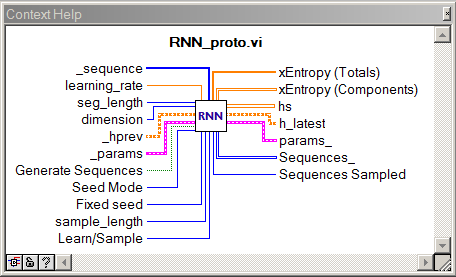
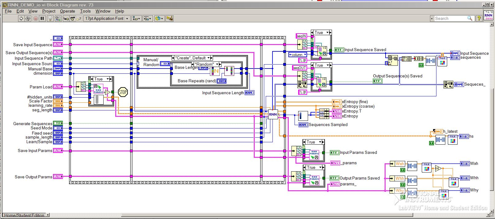
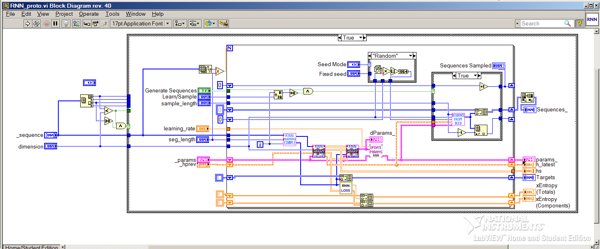
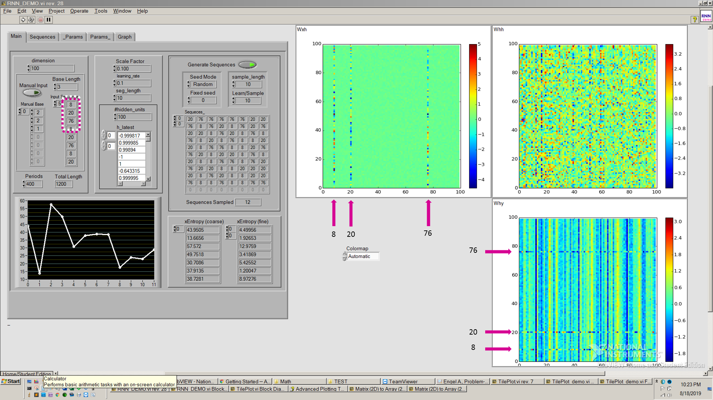
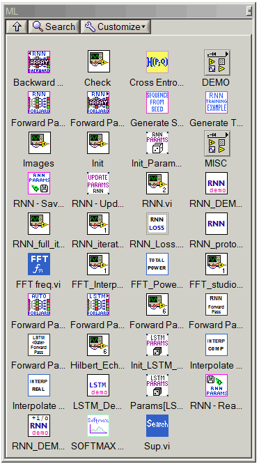
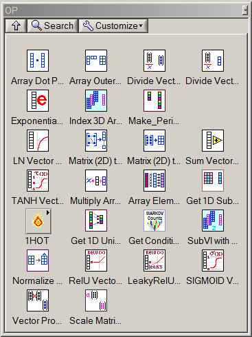
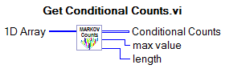
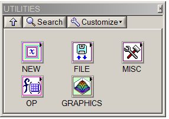

# Recurrent Neural Network (RNN) Parameter Visualizer in LabVIEW

This repository contains a library of data structures and functions commonly used in machine learning algorithms, implemented as LabVIEW VIs. 
I created this toolkit to facilitate a visual approach to machine learning program design. 

## RNN - Block Diagrams

## RNN - Parameter Visualization

## ML Tools

---

