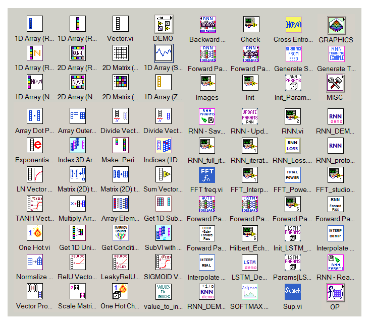
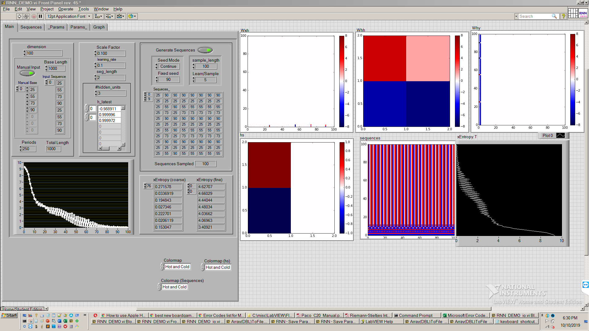

# Machine Learning Toolkit for LabVIEW

This repository contains a library of data structures and functions commonly used in machine learning algorithms, implemented as LabVIEW VIs. 
I created this toolkit to support visualizing topological features inherent in machine learning algorithms and the behavior of their learning parameters during training.

# ML Tools

## Example - Recurrent Neural Network (RNN) Parameter Visualizer

### RNN - Block Diagrams

### RNN - Parameter Visualizations

---

